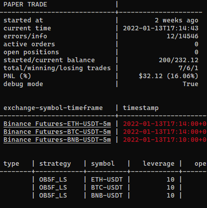

```console
[INFO | 2021-12-28T03:21:56] Running jesse v0.29.3 and jesse_live v0.0.14
Starting Timeloop..
[INFO | 2021-12-28T03:21:56] Saved daily portfolio balance: 200
Starting Timeloop..
Timeloop now started. Jobs will run based on the interval set
Starting Timeloop..
Timeloop now started. Jobs will run based on the interval set
[INFO | 2021-12-28T03:21:58] Successfully opened WS connection to "Binance Futures-BTC-USDT - DATA"
[INFO | 2021-12-28T03:21:58] Successfully opened WS connection to "Binance Futures-BNB-USDT - DATA"
[INFO | 2021-12-28T03:21:58] Successfully opened WS connection to "Binance Futures-ETH-USDT - DATA"
[INFO | 2021-12-28T03:22:17] Successfully imported candles for Binance Futures-BTC-USDT
[INFO | 2021-12-28T03:22:24] Successfully imported candles for Binance Futures-BNB-USDT
[INFO | 2021-12-28T03:22:31] Successfully imported candles for Binance Futures-ETH-USDT
[INFO | 2021-12-28T04:35:00] SUBMITTED order: BTC-USDT, MARKET, sell, -0.002, $48854.6
[INFO | 2021-12-28T04:35:01] EXECUTED order: BTC-USDT, MARKET, sell, -0.002, $48854.6
[INFO | 2021-12-28T04:35:01] Charged 0.04 as fee. Balance for USDT on Binance Futures changed from 200 to 199.96
[INFO | 2021-12-28T04:35:01] OPENED short position: Binance Futures, BTC-USDT, -0.002, $48854.6
[INFO | 2021-12-28T04:35:01] SUBMITTED order: BTC-USDT, LIMIT, buy, 0.001, $48366.1
[INFO | 2021-12-28T04:35:01] SUBMITTED order: BTC-USDT, LIMIT, buy, 0.001, $47877.5
[INFO | 2021-12-28T04:35:01] SUBMITTED order: BTC-USDT, LIMIT, buy, 0.001, $47389.0
[INFO | 2021-12-28T04:35:01] SUBMITTED order: BTC-USDT, LIMIT, buy, 0.001, $46411.9
[INFO | 2021-12-28T04:35:01] SUBMITTED order: BTC-USDT, LIMIT, buy, 0.001, $44946.2
[INFO | 2021-12-28T04:35:01] SUBMITTED order: BTC-USDT, STOP, buy, 0.002, $50504.9
[INFO | 2021-12-28T14:39:14] EXECUTED order: BTC-USDT, LIMIT, buy, 0.001, $48366.1
[INFO | 2021-12-28T14:39:14] Charged 0.02 as fee. Balance for USDT on Binance Futures changed from 199.96 to 199.94
[INFO | 2021-12-28T14:39:15] Added realized PNL of 0.49. Balance for USDT on Binance Futures changed from 199.94 to 200.43
[INFO | 2021-12-28T14:39:15] REDUCED position: Binance Futures, BTC-USDT, short, -0.001, $48854.6
[INFO | 2021-12-28T17:31:44] EXECUTED order: BTC-USDT, LIMIT, buy, 0.001, $47877.5
[INFO | 2021-12-28T17:31:44] Charged 0.02 as fee. Balance for USDT on Binance Futures changed from 200.43 to 200.41
[INFO | 2021-12-28T17:31:44] Added realized PNL of 0.98. Balance for USDT on Binance Futures changed from 200.41 to 201.39
[INFO | 2021-12-28T17:31:44] CLOSED short position: Binance Futures, BTC-USDT, OB5F_LS. PNL: $0.98, Balance: $201.39, entry: 48854.6, exit: 47877.5
[INFO | 2021-12-28T17:31:47] A closing order has been executed
[INFO | 2021-12-28T17:31:47] cancel all remaining orders to prepare for a fresh start...
[INFO | 2021-12-28T17:31:47] CANCELED order: BTC-USDT, LIMIT, buy, 0.001, $47389.0
[INFO | 2021-12-28T17:31:47] CANCELED order: BTC-USDT, LIMIT, buy, 0.001, $46411.9
[INFO | 2021-12-28T17:31:47] CANCELED order: BTC-USDT, LIMIT, buy, 0.001, $44946.2
[INFO | 2021-12-28T17:31:47] CANCELED order: BTC-USDT, STOP, buy, 0.002, $50504.9
[INFO | 2021-12-29T03:21:56] Saved daily portfolio balance: 201.39
[INFO | 2021-12-30T03:21:56] Saved daily portfolio balance: 201.39
[INFO | 2021-12-30T12:57:07] Successfully opened WS connection to "Binance Futures-BTC-USDT - DATA"
[INFO | 2021-12-31T03:21:56] Saved daily portfolio balance: 201.39
[INFO | 2022-01-01T03:21:56] Saved daily portfolio balance: 201.39
[INFO | 2022-01-02T03:21:56] Saved daily portfolio balance: 201.39
[INFO | 2022-01-03T03:21:56] Saved daily portfolio balance: 201.39
[INFO | 2022-01-04T03:21:56] Saved daily portfolio balance: 201.39
[INFO | 2022-01-04T21:53:14] Successfully opened WS connection to "Binance Futures-BNB-USDT - DATA"
[INFO | 2022-01-04T21:53:14] Successfully opened WS connection to "Binance Futures-ETH-USDT - DATA"
[INFO | 2022-01-05T03:21:56] Saved daily portfolio balance: 201.39
[INFO | 2022-01-05T22:20:01] SUBMITTED order: ETH-USDT, STOP, sell, -0.102, $3507.72
[INFO | 2022-01-05T22:20:02] EXECUTED order: ETH-USDT, STOP, sell, -0.102, $3507.72
[INFO | 2022-01-05T22:20:02] Charged 0.14 as fee. Balance for USDT on Binance Futures changed from 201.39 to 201.24
[INFO | 2022-01-05T22:20:02] OPENED short position: Binance Futures, ETH-USDT, -0.102, $3507.72
[INFO | 2022-01-05T22:20:02] SUBMITTED order: ETH-USDT, LIMIT, buy, 0.011, $3472.64
[INFO | 2022-01-05T22:20:02] SUBMITTED order: ETH-USDT, LIMIT, buy, 0.041, $3437.57
[INFO | 2022-01-05T22:20:02] SUBMITTED order: ETH-USDT, LIMIT, buy, 0.031, $3402.49
[INFO | 2022-01-05T22:20:02] SUBMITTED order: ETH-USDT, LIMIT, buy, 0.011, $3332.33
[INFO | 2022-01-05T22:20:02] SUBMITTED order: ETH-USDT, LIMIT, buy, 0.011, $3227.1
[INFO | 2022-01-05T22:20:02] SUBMITTED order: ETH-USDT, STOP, buy, 0.102, $3635.77
[INFO | 2022-01-05T22:28:35] EXECUTED order: ETH-USDT, LIMIT, buy, 0.011, $3472.64
[INFO | 2022-01-05T22:28:35] Charged 0.02 as fee. Balance for USDT on Binance Futures changed from 201.24 to 201.23
[INFO | 2022-01-05T22:28:36] Added realized PNL of 0.39. Balance for USDT on Binance Futures changed from 201.23 to 201.62
[INFO | 2022-01-05T22:28:36] REDUCED position: Binance Futures, ETH-USDT, short, -0.091, $3507.72
[INFO | 2022-01-05T22:30:00] SUBMITTED order: BNB-USDT, MARKET, sell, -0.84, $469.61
[INFO | 2022-01-05T22:30:01] EXECUTED order: BNB-USDT, MARKET, sell, -0.84, $469.61
[INFO | 2022-01-05T22:30:01] Charged 0.16 as fee. Balance for USDT on Binance Futures changed from 201.62 to 201.46
[INFO | 2022-01-05T22:30:01] OPENED short position: Binance Futures, BNB-USDT, -0.84, $469.61
[INFO | 2022-01-05T22:30:01] SUBMITTED order: BNB-USDT, LIMIT, buy, 0.09, $464.91
[INFO | 2022-01-05T22:30:01] SUBMITTED order: BNB-USDT, LIMIT, buy, 0.34, $460.22
[INFO | 2022-01-05T22:30:01] SUBMITTED order: BNB-USDT, LIMIT, buy, 0.26, $455.52
[INFO | 2022-01-05T22:30:01] SUBMITTED order: BNB-USDT, LIMIT, buy, 0.09, $446.13
[INFO | 2022-01-05T22:30:01] SUBMITTED order: BNB-USDT, LIMIT, buy, 0.09, $432.04
[INFO | 2022-01-05T22:30:01] SUBMITTED order: BNB-USDT, STOP, buy, 0.84, $489.48
[INFO | 2022-01-05T22:32:26] EXECUTED order: ETH-USDT, LIMIT, buy, 0.041, $3437.57
[INFO | 2022-01-05T22:32:27] Charged 0.06 as fee. Balance for USDT on Binance Futures changed from 201.46 to 201.4
[INFO | 2022-01-05T22:32:27] Added realized PNL of 2.88. Balance for USDT on Binance Futures changed from 201.4 to 204.28
[INFO | 2022-01-05T22:32:27] REDUCED position: Binance Futures, ETH-USDT, short, -0.05, $3507.72
[INFO | 2022-01-05T22:32:40] EXECUTED order: BNB-USDT, LIMIT, buy, 0.09, $464.91
[INFO | 2022-01-05T22:32:40] Charged 0.02 as fee. Balance for USDT on Binance Futures changed from 204.28 to 204.26
[INFO | 2022-01-05T22:32:40] Added realized PNL of 0.42. Balance for USDT on Binance Futures changed from 204.26 to 204.68
[INFO | 2022-01-05T22:32:40] REDUCED position: Binance Futures, BNB-USDT, short, -0.75, $469.61
[INFO | 2022-01-05T22:33:00] EXECUTED order: BNB-USDT, LIMIT, buy, 0.34, $460.22
[INFO | 2022-01-05T22:33:00] Charged 0.06 as fee. Balance for USDT on Binance Futures changed from 204.68 to 204.62
[INFO | 2022-01-05T22:33:00] Added realized PNL of 3.19. Balance for USDT on Binance Futures changed from 204.62 to 207.81
[INFO | 2022-01-05T22:33:00] REDUCED position: Binance Futures, BNB-USDT, short, -0.41, $469.61
[INFO | 2022-01-06T03:21:56] Saved daily portfolio balance: 209.98
[INFO | 2022-01-06T08:32:15] EXECUTED order: ETH-USDT, LIMIT, buy, 0.031, $3402.49
[INFO | 2022-01-06T08:32:15] Charged 0.04 as fee. Balance for USDT on Binance Futures changed from 207.81 to 207.77
[INFO | 2022-01-06T08:32:16] Added realized PNL of 3.26. Balance for USDT on Binance Futures changed from 207.77 to 211.03
[INFO | 2022-01-06T08:32:16] REDUCED position: Binance Futures, ETH-USDT, short, -0.019, $3507.72
[INFO | 2022-01-06T09:34:26] EXECUTED order: ETH-USDT, LIMIT, buy, 0.011, $3332.33
[INFO | 2022-01-06T09:34:26] Charged 0.01 as fee. Balance for USDT on Binance Futures changed from 211.03 to 211.02
[INFO | 2022-01-06T09:34:26] Added realized PNL of 1.93. Balance for USDT on Binance Futures changed from 211.02 to 212.95
[INFO | 2022-01-06T09:34:26] REDUCED position: Binance Futures, ETH-USDT, short, -0.008, $3507.72
[INFO | 2022-01-06T16:15:01] CANCELED order: BNB-USDT, STOP, buy, 0.84, $489.48
[INFO | 2022-01-06T16:15:02] SUBMITTED order: BNB-USDT, LIMIT, buy, 0.41, $473.31
[INFO | 2022-01-06T16:15:03] EXECUTED order: BNB-USDT, LIMIT, buy, 0.41, $473.31
[INFO | 2022-01-06T16:15:03] Charged 0.08 as fee. Balance for USDT on Binance Futures changed from 212.95 to 212.87
[INFO | 2022-01-06T16:15:03] Added realized PNL of -1.52. Balance for USDT on Binance Futures changed from 212.87 to 211.35
[INFO | 2022-01-06T16:15:03] CLOSED short position: Binance Futures, BNB-USDT, OB5F_LS. PNL: $-1.52, Balance: $211.35, entry: 469.61, exit: 473.31
[INFO | 2022-01-06T16:15:03] A closing order has been executed
[INFO | 2022-01-06T16:15:03] cancel all remaining orders to prepare for a fresh start...
[INFO | 2022-01-06T16:15:03] CANCELED order: BNB-USDT, LIMIT, buy, 0.26, $455.52
[INFO | 2022-01-06T16:15:03] CANCELED order: BNB-USDT, LIMIT, buy, 0.09, $446.13
[INFO | 2022-01-06T16:15:03] CANCELED order: BNB-USDT, LIMIT, buy, 0.09, $432.04
[INFO | 2022-01-06T19:40:01] SUBMITTED order: ETH-USDT, MARKET, buy, 0.008, $3440.87
[INFO | 2022-01-06T19:40:01] EXECUTED order: ETH-USDT, MARKET, buy, 0.008, $3440.87
[INFO | 2022-01-06T19:40:01] Charged 0.01 as fee. Balance for USDT on Binance Futures changed from 211.35 to 211.34
[INFO | 2022-01-06T19:40:01] Added realized PNL of 0.53. Balance for USDT on Binance Futures changed from 211.34 to 211.88
[INFO | 2022-01-06T19:40:01] CLOSED short position: Binance Futures, ETH-USDT, OB5F_LS. PNL: $0.53, Balance: $211.88, entry: 3507.72, exit: 3440.87
[INFO | 2022-01-06T19:40:01] A closing order has been executed
[INFO | 2022-01-06T19:40:01] cancel all remaining orders to prepare for a fresh start...
[INFO | 2022-01-06T19:40:02] CANCELED order: ETH-USDT, LIMIT, buy, 0.011, $3227.1
[INFO | 2022-01-06T19:40:02] CANCELED order: ETH-USDT, STOP, buy, 0.102, $3635.77
[INFO | 2022-01-07T03:21:56] Saved daily portfolio balance: 211.88
[INFO | 2022-01-07T04:05:01] SUBMITTED order: ETH-USDT, MARKET, sell, -0.122, $3229.82
[INFO | 2022-01-07T04:05:02] EXECUTED order: ETH-USDT, MARKET, sell, -0.122, $3229.82
[INFO | 2022-01-07T04:05:02] Charged 0.16 as fee. Balance for USDT on Binance Futures changed from 211.88 to 211.72
[INFO | 2022-01-07T04:05:02] OPENED short position: Binance Futures, ETH-USDT, -0.122, $3229.82
[INFO | 2022-01-07T04:05:03] SUBMITTED order: ETH-USDT, LIMIT, buy, 0.013, $3197.52
[INFO | 2022-01-07T04:05:03] SUBMITTED order: ETH-USDT, LIMIT, buy, 0.049, $3165.22
[INFO | 2022-01-07T04:05:03] SUBMITTED order: ETH-USDT, LIMIT, buy, 0.037, $3132.93
[INFO | 2022-01-07T04:05:03] SUBMITTED order: ETH-USDT, LIMIT, buy, 0.013, $3068.33
[INFO | 2022-01-07T04:05:03] SUBMITTED order: ETH-USDT, LIMIT, buy, 0.013, $2971.43
[INFO | 2022-01-07T04:05:03] SUBMITTED order: ETH-USDT, STOP, buy, 0.122, $3352.53
[INFO | 2022-01-07T04:17:56] EXECUTED order: ETH-USDT, LIMIT, buy, 0.013, $3197.52
[INFO | 2022-01-07T04:17:56] Charged 0.02 as fee. Balance for USDT on Binance Futures changed from 211.72 to 211.7
[INFO | 2022-01-07T04:17:56] Added realized PNL of 0.42. Balance for USDT on Binance Futures changed from 211.7 to 212.12
[INFO | 2022-01-07T04:17:56] REDUCED position: Binance Futures, ETH-USDT, short, -0.109, $3229.82
[INFO | 2022-01-07T04:19:45] EXECUTED order: ETH-USDT, LIMIT, buy, 0.049, $3165.22
[INFO | 2022-01-07T04:19:45] Charged 0.06 as fee. Balance for USDT on Binance Futures changed from 212.12 to 212.06
[INFO | 2022-01-07T04:19:45] Added realized PNL of 3.17. Balance for USDT on Binance Futures changed from 212.06 to 215.23
[INFO | 2022-01-07T04:19:45] REDUCED position: Binance Futures, ETH-USDT, short, -0.06, $3229.82
[INFO | 2022-01-07T04:25:01] SUBMITTED order: BNB-USDT, MARKET, sell, -0.96, $446.16
[INFO | 2022-01-07T04:25:01] EXECUTED order: BNB-USDT, MARKET, sell, -0.96, $446.16
[INFO | 2022-01-07T04:25:01] Charged 0.17 as fee. Balance for USDT on Binance Futures changed from 215.23 to 215.06
[INFO | 2022-01-07T04:25:01] OPENED short position: Binance Futures, BNB-USDT, -0.96, $446.16
[INFO | 2022-01-07T04:25:01] SUBMITTED order: BNB-USDT, LIMIT, buy, 0.1, $441.7
[INFO | 2022-01-07T04:25:01] SUBMITTED order: BNB-USDT, LIMIT, buy, 0.39, $437.24
[INFO | 2022-01-07T04:25:01] SUBMITTED order: BNB-USDT, LIMIT, buy, 0.29, $432.78
[INFO | 2022-01-07T04:25:01] SUBMITTED order: BNB-USDT, LIMIT, buy, 0.1, $423.85
[INFO | 2022-01-07T04:25:01] SUBMITTED order: BNB-USDT, LIMIT, buy, 0.1, $410.47
[INFO | 2022-01-07T04:25:01] SUBMITTED order: BNB-USDT, STOP, buy, 0.96, $462.36
[INFO | 2022-01-07T04:33:21] EXECUTED order: BNB-USDT, LIMIT, buy, 0.1, $441.7
[INFO | 2022-01-07T04:33:21] Charged 0.02 as fee. Balance for USDT on Binance Futures changed from 215.06 to 215.04
[INFO | 2022-01-07T04:33:21] Added realized PNL of 0.45. Balance for USDT on Binance Futures changed from 215.04 to 215.48
[INFO | 2022-01-07T04:33:21] REDUCED position: Binance Futures, BNB-USDT, short, -0.86, $446.16
[INFO | 2022-01-07T07:05:01] EXECUTED order: ETH-USDT, LIMIT, buy, 0.037, $3132.93
[INFO | 2022-01-07T07:05:01] Charged 0.05 as fee. Balance for USDT on Binance Futures changed from 215.48 to 215.44
[INFO | 2022-01-07T07:05:01] Added realized PNL of 3.58. Balance for USDT on Binance Futures changed from 215.44 to 219.02
[INFO | 2022-01-07T07:05:01] REDUCED position: Binance Futures, ETH-USDT, short, -0.023, $3229.82
[INFO | 2022-01-07T07:12:23] EXECUTED order: BNB-USDT, LIMIT, buy, 0.39, $437.24
[INFO | 2022-01-07T07:12:23] Charged 0.07 as fee. Balance for USDT on Binance Futures changed from 219.02 to 218.95
[INFO | 2022-01-07T07:12:23] Added realized PNL of 3.48. Balance for USDT on Binance Futures changed from 218.95 to 222.43
[INFO | 2022-01-07T07:12:23] REDUCED position: Binance Futures, BNB-USDT, short, -0.47, $446.16
[INFO | 2022-01-07T15:52:53] EXECUTED order: ETH-USDT, LIMIT, buy, 0.013, $3068.33
[INFO | 2022-01-07T15:52:54] Charged 0.02 as fee. Balance for USDT on Binance Futures changed from 222.43 to 222.42
[INFO | 2022-01-07T15:52:54] Added realized PNL of 2.1. Balance for USDT on Binance Futures changed from 222.42 to 224.52
[INFO | 2022-01-07T15:52:54] REDUCED position: Binance Futures, ETH-USDT, short, -0.01, $3229.82
[INFO | 2022-01-08T03:21:56] Saved daily portfolio balance: 222.76
[INFO | 2022-01-08T17:59:54] EXECUTED order: BNB-USDT, LIMIT, buy, 0.29, $432.78
[INFO | 2022-01-08T17:59:54] Charged 0.05 as fee. Balance for USDT on Binance Futures changed from 224.52 to 224.47
[INFO | 2022-01-08T17:59:55] Added realized PNL of 3.88. Balance for USDT on Binance Futures changed from 224.47 to 228.35
[INFO | 2022-01-08T17:59:55] REDUCED position: Binance Futures, BNB-USDT, short, -0.18, $446.16
[INFO | 2022-01-08T18:12:26] EXECUTED order: BNB-USDT, LIMIT, buy, 0.1, $423.85
[INFO | 2022-01-08T18:12:26] Charged 0.02 as fee. Balance for USDT on Binance Futures changed from 228.35 to 228.33
[INFO | 2022-01-08T18:12:26] Added realized PNL of 2.23. Balance for USDT on Binance Futures changed from 228.33 to 230.56
[INFO | 2022-01-08T18:12:26] REDUCED position: Binance Futures, BNB-USDT, short, -0.08, $446.16
[INFO | 2022-01-09T01:45:01] SUBMITTED order: BNB-USDT, MARKET, buy, 0.08, $430.28
[INFO | 2022-01-09T01:45:02] EXECUTED order: BNB-USDT, MARKET, buy, 0.08, $430.28
[INFO | 2022-01-09T01:45:02] Charged 0.01 as fee. Balance for USDT on Binance Futures changed from 230.56 to 230.55
[INFO | 2022-01-09T01:45:02] Added realized PNL of 1.27. Balance for USDT on Binance Futures changed from 230.55 to 231.82
[INFO | 2022-01-09T01:45:02] CLOSED short position: Binance Futures, BNB-USDT, OB5F_LS. PNL: $1.27, Balance: $231.82, entry: 446.16, exit: 430.28
[INFO | 2022-01-09T01:45:02] A closing order has been executed
[INFO | 2022-01-09T01:45:02] cancel all remaining orders to prepare for a fresh start...
[INFO | 2022-01-09T01:45:02] CANCELED order: BNB-USDT, LIMIT, buy, 0.1, $410.47
[INFO | 2022-01-09T01:45:02] CANCELED order: BNB-USDT, STOP, buy, 0.96, $462.36
[INFO | 2022-01-09T02:25:00] SUBMITTED order: ETH-USDT, MARKET, buy, 0.01, $3126.41
[INFO | 2022-01-09T02:25:01] EXECUTED order: ETH-USDT, MARKET, buy, 0.01, $3126.41
[INFO | 2022-01-09T02:25:01] Charged 0.01 as fee. Balance for USDT on Binance Futures changed from 231.82 to 231.8
[INFO | 2022-01-09T02:25:01] Added realized PNL of 1.03. Balance for USDT on Binance Futures changed from 231.8 to 232.84
[INFO | 2022-01-09T02:25:01] CLOSED short position: Binance Futures, ETH-USDT, OB5F_LS. PNL: $1.03, Balance: $232.84, entry: 3229.82, exit: 3126.41
[INFO | 2022-01-09T02:25:01] A closing order has been executed
[INFO | 2022-01-09T02:25:01] cancel all remaining orders to prepare for a fresh start...
[INFO | 2022-01-09T02:25:01] CANCELED order: ETH-USDT, LIMIT, buy, 0.013, $2971.43
[INFO | 2022-01-09T02:25:01] CANCELED order: ETH-USDT, STOP, buy, 0.122, $3352.53
[INFO | 2022-01-09T03:21:56] Saved daily portfolio balance: 232.84
[INFO | 2022-01-10T03:21:56] Saved daily portfolio balance: 232.84
[INFO | 2022-01-10T14:35:01] SUBMITTED order: ETH-USDT, LIMIT, sell, -0.142, $2933.37
[INFO | 2022-01-10T14:35:01] EXECUTED order: ETH-USDT, LIMIT, sell, -0.142, $2933.37
[INFO | 2022-01-10T14:35:01] Charged 0.17 as fee. Balance for USDT on Binance Futures changed from 232.84 to 232.67
[INFO | 2022-01-10T14:35:01] OPENED short position: Binance Futures, ETH-USDT, -0.142, $2933.37
[INFO | 2022-01-10T14:35:02] SUBMITTED order: ETH-USDT, LIMIT, buy, 0.015, $2904.04
[INFO | 2022-01-10T14:35:02] SUBMITTED order: ETH-USDT, LIMIT, buy, 0.057, $2874.7
[INFO | 2022-01-10T14:35:02] SUBMITTED order: ETH-USDT, LIMIT, buy, 0.043, $2845.37
[INFO | 2022-01-10T14:35:02] SUBMITTED order: ETH-USDT, LIMIT, buy, 0.015, $2786.7
[INFO | 2022-01-10T14:35:02] SUBMITTED order: ETH-USDT, LIMIT, buy, 0.015, $2698.7
[INFO | 2022-01-10T14:35:02] SUBMITTED order: ETH-USDT, STOP, buy, 0.142, $3049.79
[INFO | 2022-01-10T16:18:10] EXECUTED order: ETH-USDT, STOP, buy, 0.142, $3049.79
[INFO | 2022-01-10T16:18:10] Charged 0.17 as fee. Balance for USDT on Binance Futures changed from 232.67 to 232.5
[INFO | 2022-01-10T16:18:11] Added realized PNL of -16.53. Balance for USDT on Binance Futures changed from 232.5 to 215.97
[INFO | 2022-01-10T16:18:11] CLOSED short position: Binance Futures, ETH-USDT, OB5F_LS. PNL: $-16.53, Balance: $215.97, entry: 2933.37, exit: 3049.79
[INFO | 2022-01-10T16:18:12] A closing order has been executed
[INFO | 2022-01-10T16:18:12] cancel all remaining orders to prepare for a fresh start...
[INFO | 2022-01-10T16:18:12] CANCELED order: ETH-USDT, LIMIT, buy, 0.015, $2904.04
[INFO | 2022-01-10T16:18:12] CANCELED order: ETH-USDT, LIMIT, buy, 0.057, $2874.7
[INFO | 2022-01-10T16:18:12] CANCELED order: ETH-USDT, LIMIT, buy, 0.043, $2845.37
[INFO | 2022-01-10T16:18:12] CANCELED order: ETH-USDT, LIMIT, buy, 0.015, $2786.7
[INFO | 2022-01-10T16:18:12] CANCELED order: ETH-USDT, LIMIT, buy, 0.015, $2698.7
[INFO | 2022-01-11T03:21:56] Saved daily portfolio balance: 215.97
[INFO | 2022-01-11T08:05:01] SUBMITTED order: BNB-USDT, STOP, buy, 0.94, $451.31
[INFO | 2022-01-11T08:05:05] EXECUTED order: BNB-USDT, STOP, buy, 0.94, $451.31
[INFO | 2022-01-11T08:05:05] Charged 0.17 as fee. Balance for USDT on Binance Futures changed from 215.97 to 215.8
[INFO | 2022-01-11T08:05:05] OPENED long position: Binance Futures, BNB-USDT, 0.94, $451.31
[INFO | 2022-01-11T08:05:05] SUBMITTED order: BNB-USDT, LIMIT, sell, -0.18, $455.82
[INFO | 2022-01-11T08:05:05] SUBMITTED order: BNB-USDT, LIMIT, sell, -0.09, $460.34
[INFO | 2022-01-11T08:05:05] SUBMITTED order: BNB-USDT, LIMIT, sell, -0.18, $464.85
[INFO | 2022-01-11T08:05:05] SUBMITTED order: BNB-USDT, LIMIT, sell, -0.37, $473.88
[INFO | 2022-01-11T08:05:05] SUBMITTED order: BNB-USDT, LIMIT, sell, -0.09, $487.41
[INFO | 2022-01-11T08:05:05] SUBMITTED order: BNB-USDT, STOP, sell, -0.94, $432.05
[INFO | 2022-01-11T16:06:12] EXECUTED order: BNB-USDT, LIMIT, sell, -0.18, $455.82
[INFO | 2022-01-11T16:06:12] Charged 0.03 as fee. Balance for USDT on Binance Futures changed from 215.8 to 215.76
[INFO | 2022-01-11T16:06:13] Added realized PNL of 0.81. Balance for USDT on Binance Futures changed from 215.76 to 216.58
[INFO | 2022-01-11T16:06:13] REDUCED position: Binance Futures, BNB-USDT, long, 0.76, $451.31
[INFO | 2022-01-11T16:33:17] EXECUTED order: BNB-USDT, LIMIT, sell, -0.09, $460.34
[INFO | 2022-01-11T16:33:17] Charged 0.02 as fee. Balance for USDT on Binance Futures changed from 216.58 to 216.56
[INFO | 2022-01-11T16:33:17] Added realized PNL of 0.81. Balance for USDT on Binance Futures changed from 216.56 to 217.37
[INFO | 2022-01-11T16:33:17] REDUCED position: Binance Futures, BNB-USDT, long, 0.67, $451.31
[INFO | 2022-01-11T16:40:07] EXECUTED order: BNB-USDT, LIMIT, sell, -0.18, $464.85
[INFO | 2022-01-11T16:40:07] Charged 0.03 as fee. Balance for USDT on Binance Futures changed from 217.37 to 217.34
[INFO | 2022-01-11T16:40:07] Added realized PNL of 2.44. Balance for USDT on Binance Futures changed from 217.34 to 219.78
[INFO | 2022-01-11T16:40:07] REDUCED position: Binance Futures, BNB-USDT, long, 0.49, $451.31
[INFO | 2022-01-12T03:21:56] Saved daily portfolio balance: 223.5
[INFO | 2022-01-12T13:03:59] EXECUTED order: BNB-USDT, LIMIT, sell, -0.37, $473.88
[INFO | 2022-01-12T13:04:00] Charged 0.07 as fee. Balance for USDT on Binance Futures changed from 219.78 to 219.71
[INFO | 2022-01-12T13:04:00] Added realized PNL of 8.35. Balance for USDT on Binance Futures changed from 219.71 to 228.06
[INFO | 2022-01-12T13:04:00] REDUCED position: Binance Futures, BNB-USDT, long, 0.12, $451.31
[INFO | 2022-01-12T21:24:48] EXECUTED order: BNB-USDT, LIMIT, sell, -0.09, $487.41
[INFO | 2022-01-12T21:24:48] Charged 0.02 as fee. Balance for USDT on Binance Futures changed from 228.06 to 228.04
[INFO | 2022-01-12T21:24:48] Added realized PNL of 3.25. Balance for USDT on Binance Futures changed from 228.04 to 231.29
[INFO | 2022-01-12T21:24:48] REDUCED position: Binance Futures, BNB-USDT, long, 0.03, $451.31
[INFO | 2022-01-13T03:21:56] Saved daily portfolio balance: 232.05
[INFO | 2022-01-13T04:50:00] SUBMITTED order: BNB-USDT, MARKET, sell, -0.03, $479.15
[INFO | 2022-01-13T04:50:02] EXECUTED order: BNB-USDT, MARKET, sell, -0.03, $479.15
[INFO | 2022-01-13T04:50:02] Charged 0.01 as fee. Balance for USDT on Binance Futures changed from 231.29 to 231.28
[INFO | 2022-01-13T04:50:02] Added realized PNL of 0.84. Balance for USDT on Binance Futures changed from 231.28 to 232.12
[INFO | 2022-01-13T04:50:02] CLOSED long position: Binance Futures, BNB-USDT, OB5F_LS. PNL: $0.84, Balance: $232.12, entry: 451.31, exit: 479.15
[INFO | 2022-01-13T04:50:02] A closing order has been executed
[INFO | 2022-01-13T04:50:02] cancel all remaining orders to prepare for a fresh start...
[INFO | 2022-01-13T04:50:02] CANCELED order: BNB-USDT, STOP, sell, -0.94, $432.05
```

##### Explore [ysdede.github.io/benchmarks/#OB5F_LS](https://ysdede.github.io/benchmarks/#OB5F_LS/) for benchmark results.
